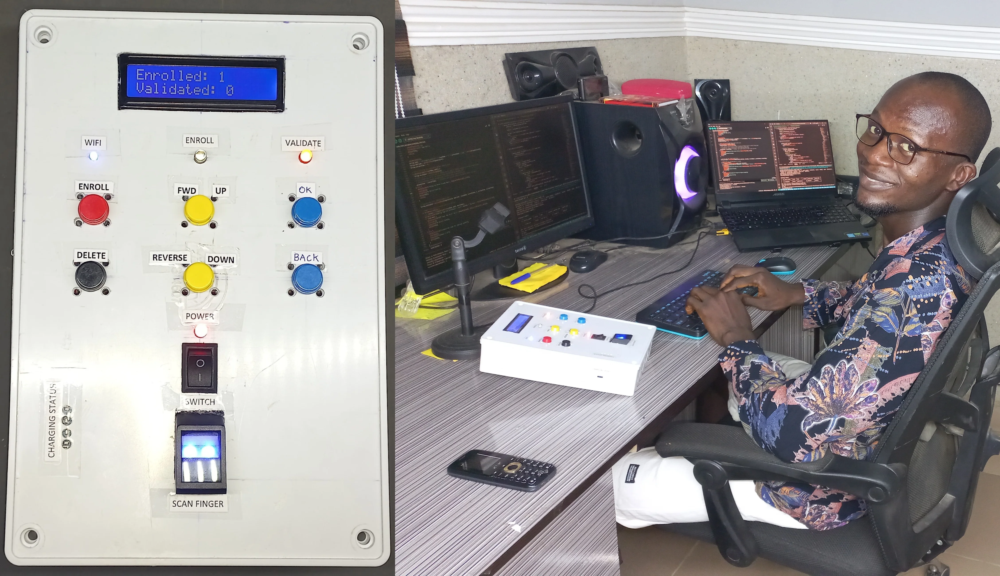
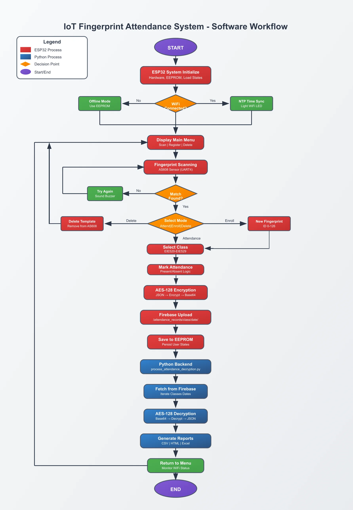

# IoT-Based Fingerprint Attendance System for Educational Institutions
An IoT-based biometric attendance system designed for educational institutions, leveraging ESP32, AS608 fingerprint sensor, Firebase Realtime Database, and Python for secure, real-time attendance tracking. This system automates attendance management, ensures data security with AES-128 encryption, and generates detailed reports in CSV, HTML, and Excel formats.




[](https://opensource.org/licenses/MIT)
[](https://www.espressif.com/en/products/socs/esp32)
[](https://firebase.google.com/)
[](https://www.python.org/)

## Table of Contents
- [Overview](#overview)
- [Features](#features)
- [Hardware Requirements](#hardware-requirements)
- [Software Requirements](#software-requirements)
- [Setup Instructions](#setup-instructions)
- [Usage](#usage)
- [Software Workflow](#software-workflow)
- [Screenshots](#screenshots)
- [Demo](#demo)
- [Contributing](#contributing)
- [License](#license)
- [Contact](#contact)

## Overview
This project implements a portable, IoT-based fingerprint attendance system tailored for educational institutions. It uses the ESP32 microcontroller to interface with the AS608 fingerprint sensor, a 16x2 LCD, and push buttons for user interaction. Attendance data is encrypted with AES-128, stored in Firebase, and processed by a Python backend to generate comprehensive reports. The system eliminates manual attendance tracking, reduces proxy risks, and ensures data integrity. [Read more](https://damilarelekanadekeye.github.io/#Design-and-Implementation-of-an-IoT-Based-Fingerprint-Attendance-System-for-Educational-Institutions)

## Features
- **Biometric Authentication**: Secure fingerprint-based attendance using the AS608 sensor.
- **Real-Time Tracking**: Uploads encrypted data to Firebase for instant access.
- **User-Friendly Interface**: 16x2 LCD and push buttons for class selection, enrollment, and deletion.
- **Data Security**: AES-128 encryption for attendance records.
- **Offline Support**: Stores data in EEPROM during WiFi outages.
- **Multi-Format Reports**: Generates CSV, HTML, and Excel reports via Python.
- **Course-Specific Attendance**: Supports classes EIE520–EIE529 with course-wise logging.

## Hardware Requirements
- ESP32 Dev Module
- AS608 Fingerprint Sensor
- 16x2 LCD with I2C
- Push Buttons (Register, Delete, Forward, Reverse, OK)
- LEDs (WiFi, Validate, Enroll)
- Buzzer
- 10kΩ Resistors, Breadboard, Jumper Wires

## Software Requirements
- **Arduino IDE** with ESP32 board support
- Libraries: `Adafruit_Fingerprint`, `Firebase_ESP_Client`, `LiquidCrystal_I2C`, `EEPROM`
- **Python 3.x** with libraries: `pyrebase`, `pycryptodome`, `pandas`, `tabulate`, `openpyxl`
- Firebase Realtime Database account
- NTP Server access for time synchronization

## Setup Instructions
1. **Hardware Setup**:
   - Connect the AS608 sensor to ESP32 (GPIO 16 RX, GPIO 17 TX).
   - Wire the LCD (I2C: SDA to GPIO 21, SCL to GPIO 22).
   - Attach buttons (GPIO 13, 25, 12, 26, 14), LEDs (GPIO 15, 2, 4), and buzzer (GPIO 32).
   - See [Circuit Diagram](images/circuit-diagram.jpg).

2. **ESP32 Firmware**:
   - Clone this repository: `git clone https://github.com/damilarelekanadekeye/fingerprint-attendance-system.git`
   - Open `fingerprint_attendance.ino` in Arduino IDE.
   - Install required libraries via Library Manager.
   - Update WiFi credentials and Firebase API key in the code.
   - Upload to ESP32.

3. **Python Backend**:
   - Install Python dependencies: `pip install pyrebase pycryptodome pandas tabulate openpyxl`
   - Update `process_attendance_decryption.py` with Firebase credentials and AES key/IV.
   - Run: `python process_attendance_decryption.py`

4. **Firebase Configuration**:
   - Create a Firebase project and enable Realtime Database.
   - Set up rules to allow read/write with authentication.
   - Copy API key and database URL to ESP32 and Python scripts.

## Usage
1. **Power On**: ESP32 initializes, connects to WiFi, and syncs time via NTP.
2. **Main Menu**: LCD shows options for scanning, enrolling, or deleting fingerprints.
3. **Attendance**:
   - Scan fingerprint; select class (EIE520–EIE529) using buttons.
   - Attendance (present/absent) is marked, encrypted, and uploaded to Firebase.
4. **Enrollment**: Press Register, scan fingerprint twice, and save to AS608 and Firebase.
5. **Deletion**: Press Delete, select ID, and remove fingerprint.
6. **Reports**: Run Python script to fetch, decrypt, and generate reports in `attendance/` folder.

## Software Workflow


### Read on Github [Here!](https://github.com/damilarelekanadekeye/SOFTWARE-A-Server-side-Fingerprint-Attendance-System-For-Educational-Institutions)
### Read on My Portolio [Server-Side-Data-Processing-for-IoT-Fingerprint-Attendance-System](https://damilarelekanadekeye.github.io/#Server-Side-Data-Processing-for-IoT-Fingerprint-Attendance-System)

1. Initialize ESP32 and hardware.
2. Connect to WiFi and sync time.
3. Display main menu (scan, enroll, delete).
4. Scan fingerprint; retry if no match.
5. Select class and mark attendance.
6. Encrypt data (AES-128, Base64).
7. Upload to Firebase or store in EEPROM if offline.
8. Save state to EEPROM.
9. Python backend fetches, decrypts, and generates reports (CSV, HTML, Excel).
10. Return to main menu.

## Screenshots

### Excel Report


### See more information, results and pictures [here!](https://damilarelekanadekeye.github.io/#Design-and-Implementation-of-an-IoT-Based-Fingerprint-Attendance-System-for-Educational-Institutions)

## Demo
Watch the system in action: [YouTube Demo Coming soon!](https://www.youtube.com/watch?v=XXXXXXX)

## Contributing
Contributions are welcome! Please:
1. Fork the repository.
2. Create a feature branch: `git checkout -b feature-name`
3. Commit changes: `git commit -m "Add feature"`
4. Push to branch: `git push origin feature-name`
5. Open a pull request.

## License
This project is licensed under the MIT License - see the [LICENSE](LICENSE) file for details.

## Contact
- **Author**: Damilare Lekan Adekeye
- **Portfolio**: [damilarelekanadekeye.github.io/](https://damilarelekanadekeye.github.io/)
- **Email**: [adekeyedamilarelekan@gmail.com](mailto:adekeyedamilarelekan@gmail.com)
- **GitHub**: [damilarelekanadekeye](https://github.com/damilarelekanadekeye)

---
Built with ❤️ for educational innovation.

## Repository Structure
```
server-side-fingerprint-attendance-system/
├── src/
│   └── code_main_encrypted_metadata_ONLY.ino # Python script with redacted credentials
├── images/
│   ├── banner.webp
│   ├── software-workflow.webp
│   ├── circuit-diagram.webp
│   └── excel-report1.webp
├── LICENSE # MIT License file
└── README.md # Main README
```
